# Bulk actions

Bulk actions will be added to a number of list views in the OpenShift console. This feature will allow users to perform an action on multiple resources at once. The list of actions include adding labels, adding annotations and deleting resources.

## Bulk actions in toolbar
The bulk selector will be the first component in the toolbar on pages where bulk actions are available.

Users can click the checkbox in the bulk selector to select all items in the list (a maximum of 200 items can be selected at a time). If all items are selected, the bulk selector checkbox will be filled with a check and the bulk selector will read ‘200 selected’, informing users that the max number of items in the list are selected. Clicking the bulk selector checkbox again will deselect all items.
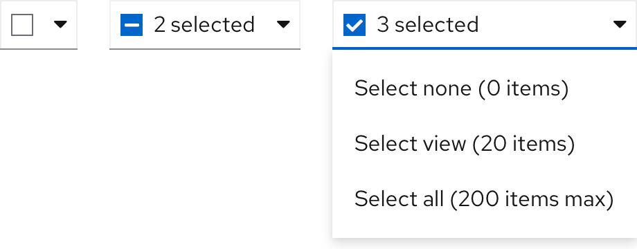

Users can also choose to select items in view by choosing the "select view" option within the bulk selector menu. The bulk selector checkbox will be filled in with a '-' to indicate that some items are selected, and the bulk selector will display the number of items selected (e.g. '8 selected'). Clicking the bulk selector checkbox will deselect all items.

Users can also choose to select a group of items by clicking the associated checkboxes next to them. The bulk selector checkbox will be filled in with a ‘-‘ to indicate that some items are selected, and the bulk selector will display the number of items selected (e.g. ‘2 selected’). Clicking the bulk selector checkbox will deselect all items.

## Behavior
If no items are selected, the bulk actions dropdown will be shown as a basic dropdown, but the actions within will be disabled. A tooltip per menu item will explain to users that they must select resources in order to take that specific action.
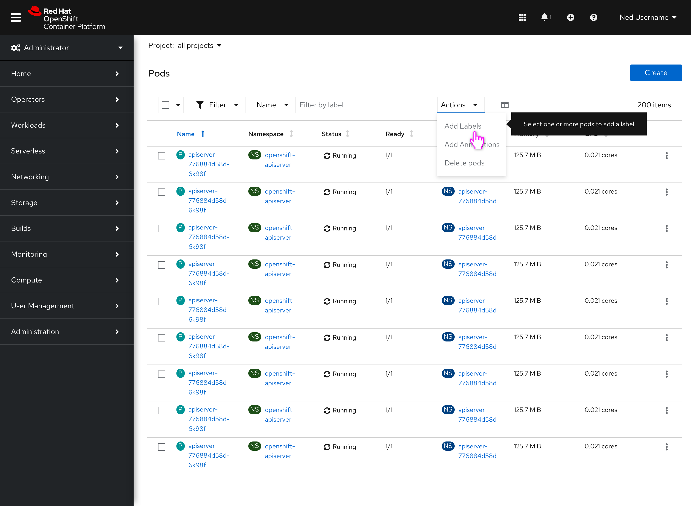

When items are selected, the bulk actions basic dropdown will turn into a primary dropdown, and actions within it will be enabled. 

### Item limits
Depending on the use case, there may be scenarios where users are limited to selecting a certain number of items, assuming there is a large total in a dataset. As a general rule of thumb, the max number of items that can be selected at once will be set at 200. 

Once the user hits that limit, they will not be able to select more items and all other checkboxes will be disabled. 
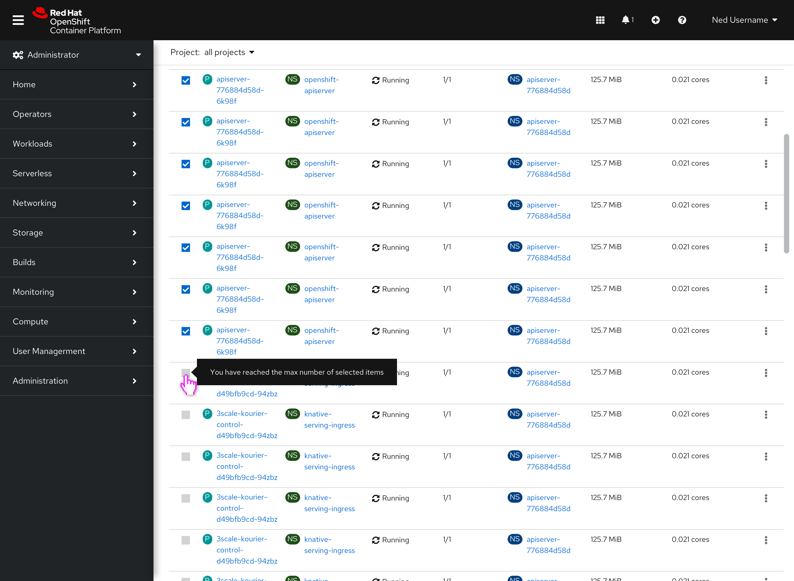

### Permission limits
Depending on the use case, there may be scenarios where users are limited to a certain set of actions to perform on items. If the user does not have permission to perform a specific action on **any** of the selected items, the action will still be enabled in the dropdown. Once they select the action, the error modal will explain that the action cannot be taken.
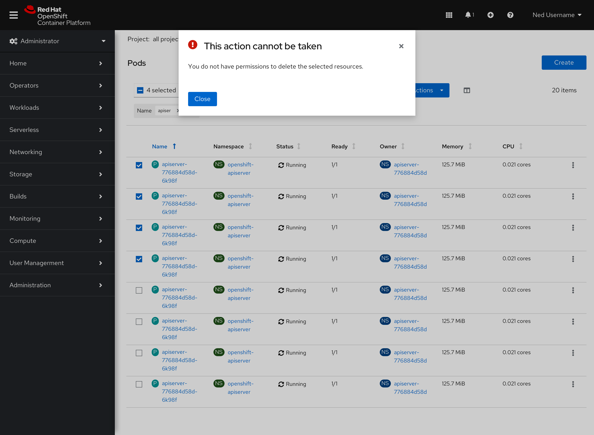

If the user has permission to perform a specific action on **some** of the selected items, the action will be carried out for all of the items that it can be. A failure alert will be included within the modal to list the items that failed to complete.
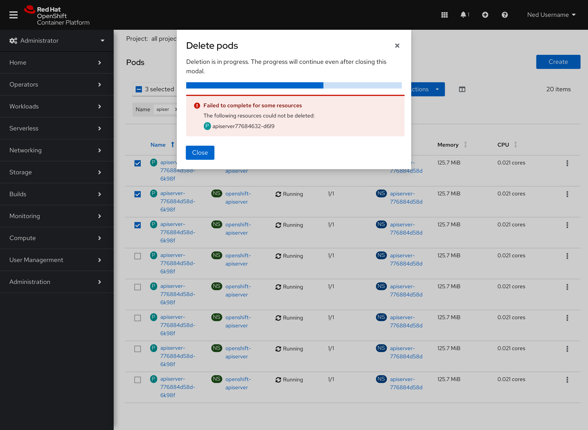

### Infinite scrolling
If a list view does not contain pagination and includes infinite scrolling, when the user uses the bulk selector to select all items, the max number of 200 items will be selected. Following interactions match the explanation above in [Item limits](#Item-limits).

The user has the option to select the items within view by selecting the bulk selector dropdown, and choosing that option.
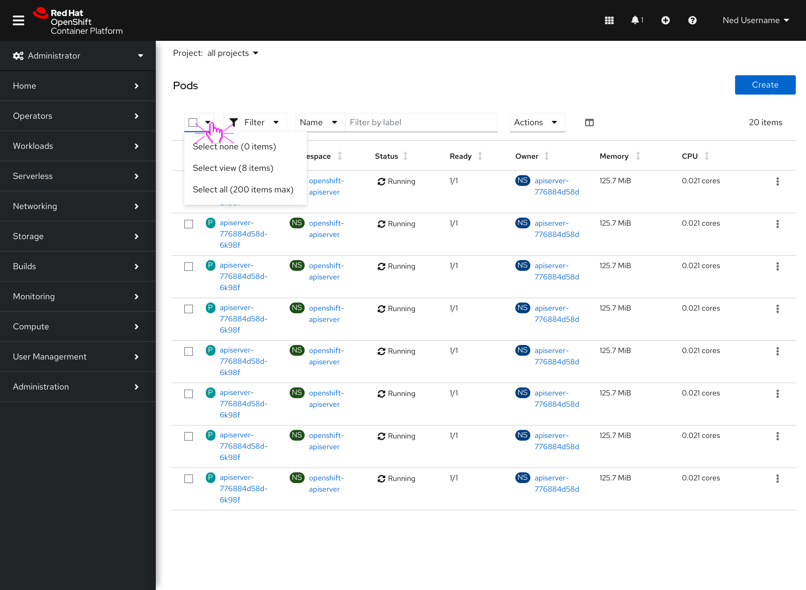

Once the user scrolls down to load more items, they would have the option to use the bulk selector menu to select page again to select all that have loaded into view.

### Filtering
If a list view contains filtering, items that have already been selected will remain selected if filters are applied or cleared. 

They may select additional items from the filtered list and once they do, the item count in the bulk selector will update to reflect the action. 

## Actions
Only specific actions will be available to take on multiple resources. The default bulk actions are `Add Labels`, `Add Annotations` and `Delete Resources`. Additional actions may be added in future depending on the resource type. When taking actions on five resources or fewer, the modal will list out the resource names. When taking actions on more than five resources, the modal will simply list the number (e.g. “Labels for 25 resources.”).

### Add Labels
The `Add Labels` modal allows the user to add labels to multiple resources and notes that existing labels may be replaced if there are duplicates. Users can add labels in the textbox and click ‘Save’ to add the labels to the selected resources. The new labels will appear in the list and the items will remain selected after the modal closes.
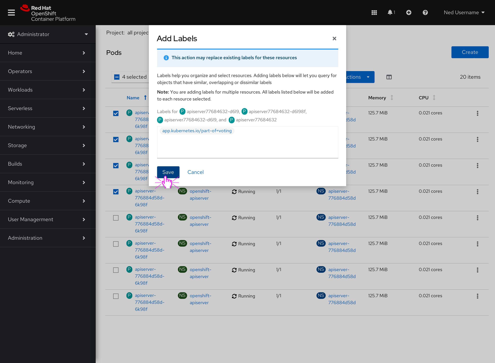

### Add Annotations
The `Add Annotations` modal allows the user to add annotations to multiple resources and notes that existing annotations may be replaced. Users can add annotations and click ‘Save’ to add the annotations to the selected resources. The items will remain selected after the modal closes.

### Delete Resources

#### No failures

The `Delete Resources` modal will list out the resources that are being chosen to be deleted and will be checked by default. There will be a bulk selector above the listed items that will allow the user to select or deselect any listed resources. This acts as a “second check” for them. The user must select “Delete” in order to begin the deletion process.
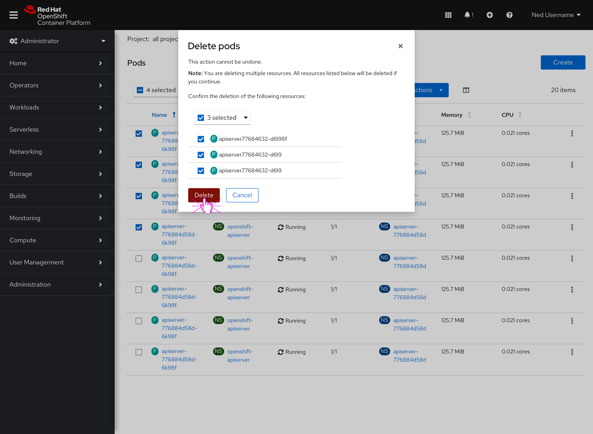

Once the deletion process begins, the messaging will be replaced with the below modal. The progress bar will track the completion progress. If the user decides to navigate away from the modal, either by selecting “Done”, the close “x” button, or navigating away from the page, the modal will close and they cannot reopen it. 
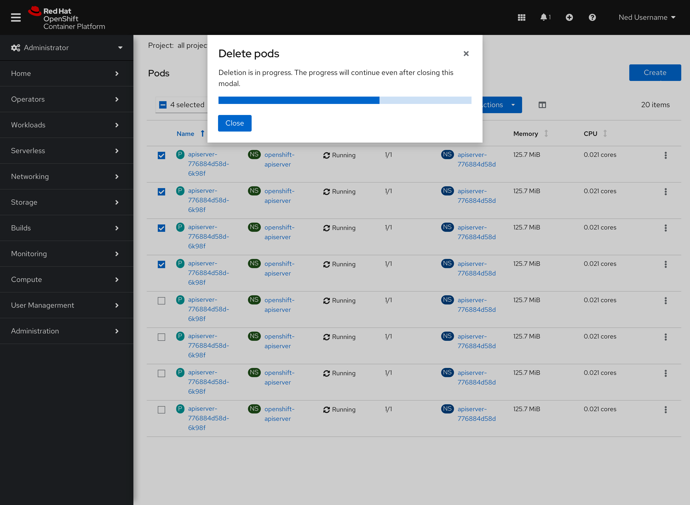

Assuming the deletion completes with no failures, the messaging will be repelaced with the below modal. 
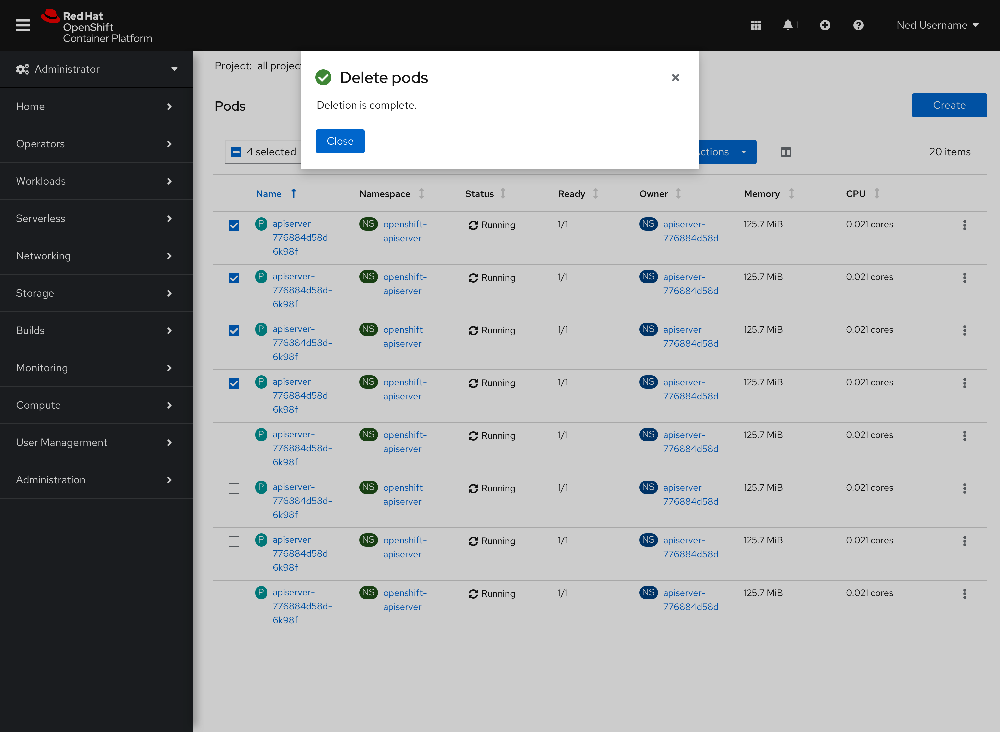

Once the user navigates back to the list view, the items will be removed from the list (or in the process of being removed) and no longer selected.

#### Failures

If there are failures during the deletion process, they will be tracked and listed in the modal, but the action will continue to be carried out. The modal will follow a similar style as that of the [Operator Installing with Common Long Running Styling](/designs/administrator/olm/installing-operator-long-running-component/)

Once the deletion has completed for the items that it can be, the final state of the modal will match as shown below. If the user had decided to navigate away from the modal or close it during deletion, the failure modal will still pop up on the screen once deletion is completed.
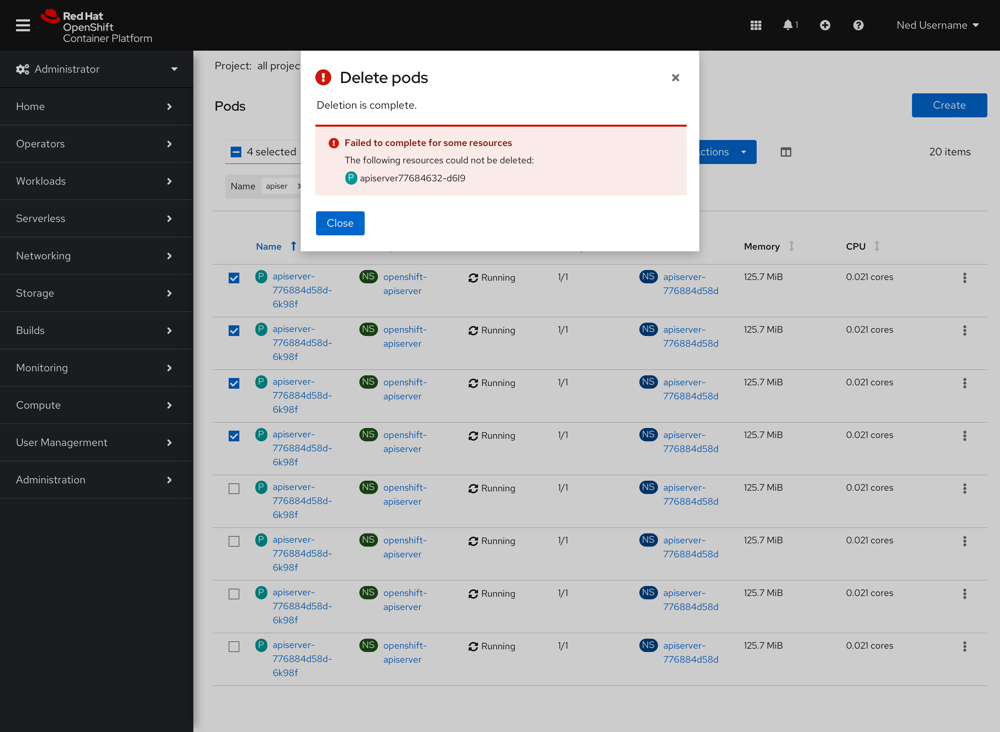

If the user navigates back to the list view, the items that were able to be removed will be removed from the list (or in the process of being removed) and no longer selected. The items that failed to be removed will still be selected within the list view.

## Future design considerations
As of today, the Admin perspective does not use toast notifications. Ideally, we would like to use toast notifications to update the user on successes and failures related to bulk actions. That way, they can continue navigating and still be updated on their actions.

An issue has been raised in PatternFly to enhance toast alerts to be able to include supportive descriptive text. This is something we could use to list specific resource failures and successes.
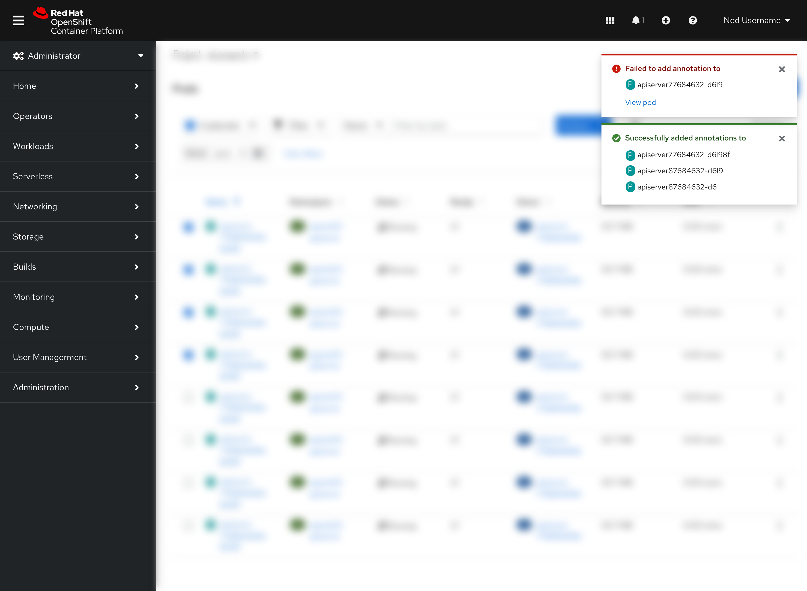

The addition of a "toast modal" component in PatternFly is also in consideration. This would be a small modal that floats on top of the page, that can be collapsed or hidden from view, that captures in progress actions.

## Relevant resources
We want the above behavior to be available on the following resource list views:
- Workloads
  - Pods
  - Deployments
  - Deployment Configs
  - Stateful Sets
  - Secrets
  - Config Maps
  - Cron Jobs
  - Jobs
  - Daemon Sets
  - Replica Sets
  - Replication Controllers
  - Horizontal Pod Autoscalers
- Serverless
- Networking
  - Services
  - Routes
  - Ingress
  - Network Policies
- Storage
  - Persistent Volumes
  - Persistent Volume Claims
  - Storage Classes
- Builds
  - Build Configs
  - Builds
  - Image Streams
- Pipelines
- Compute
  - Nodes
  - Machines
  - Machine Sets
  - Machine Autoscaler
  - Machine Health Check
  - Machine Config
  - Machine Config Pools
- User Management
  - Users
  - Groups
  - Service Accounts
- Administration
  - Namespaces
  - Resource Quotas
  - Limit Ranges
  - Custom Resource Definitions