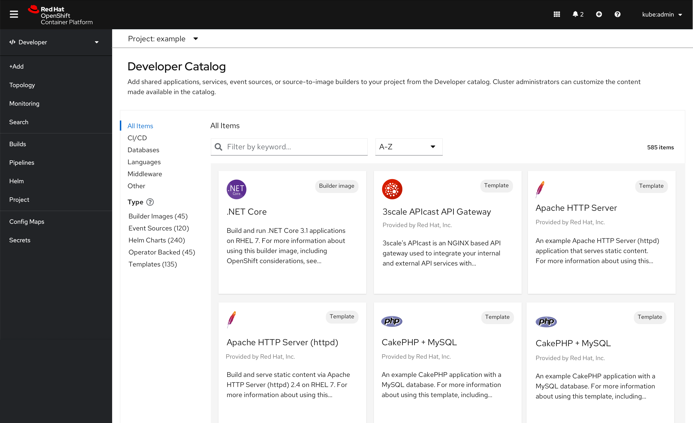
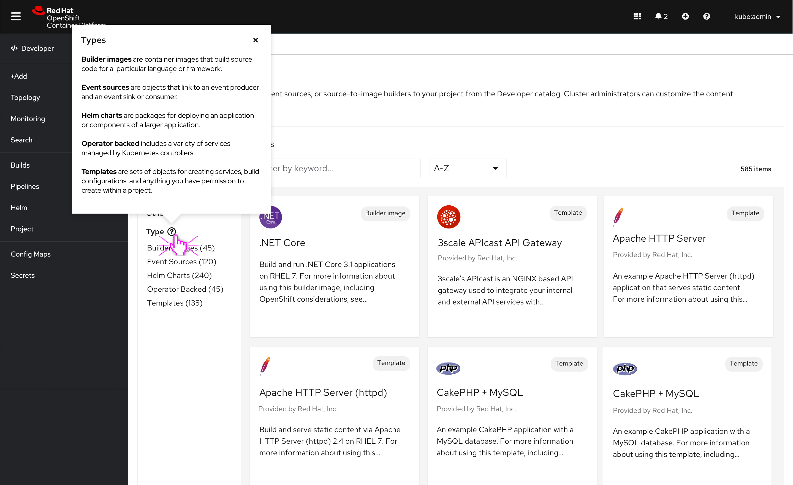
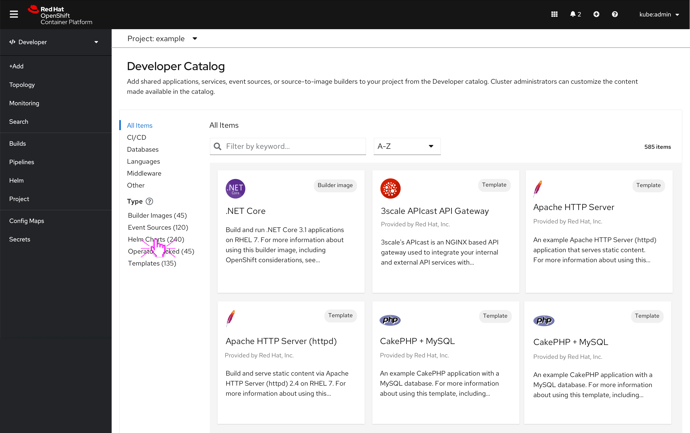
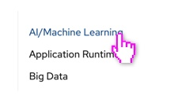
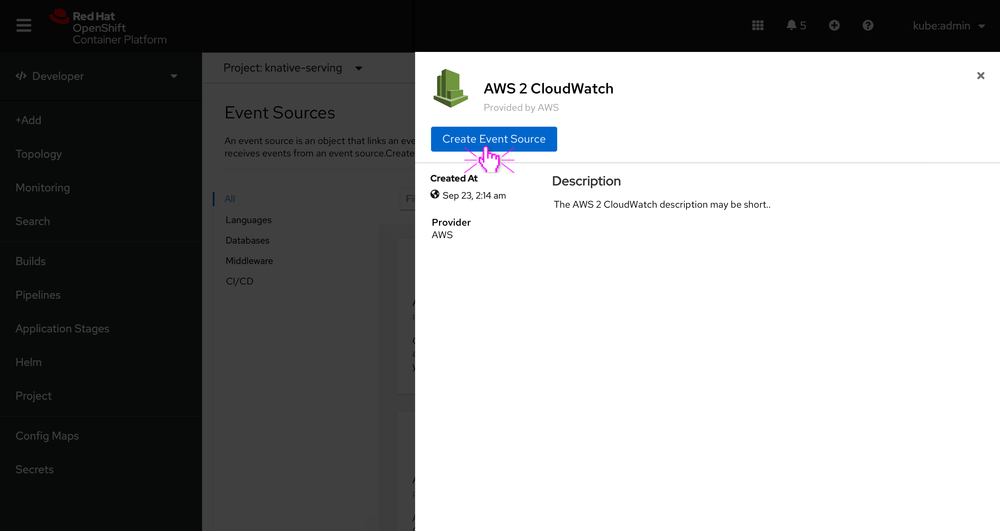
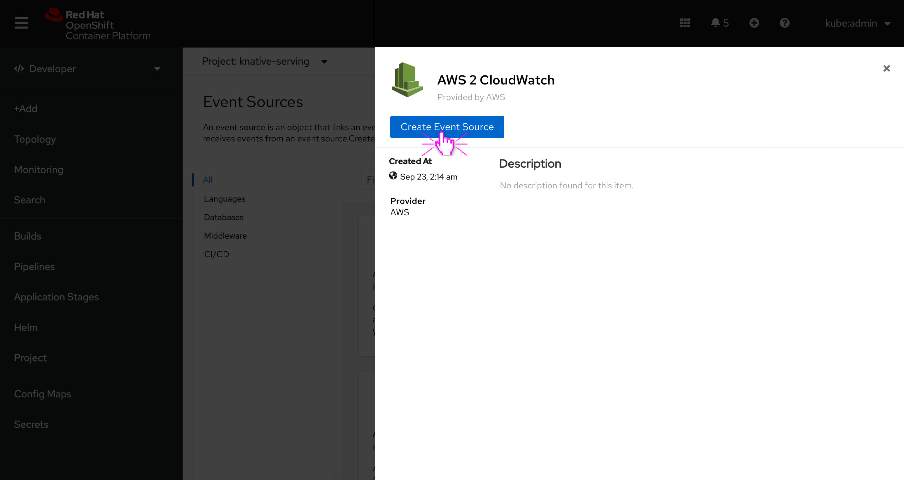
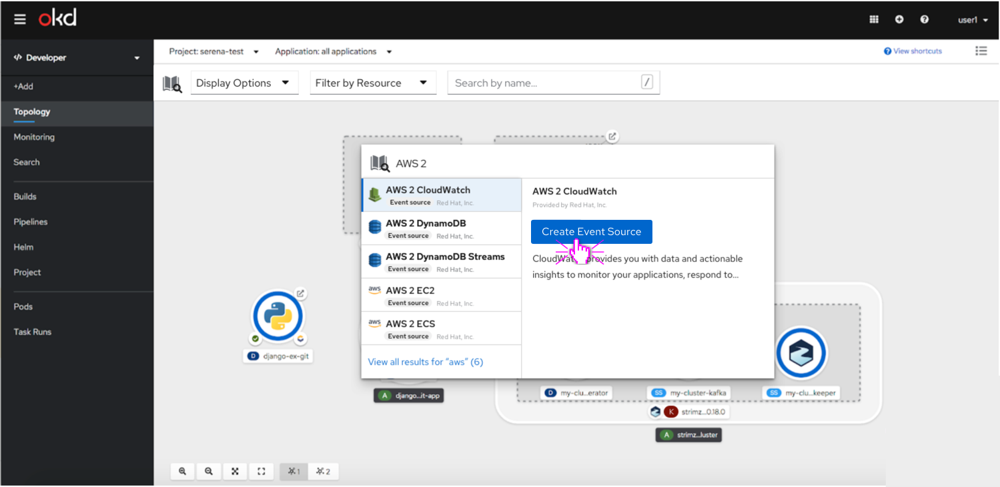
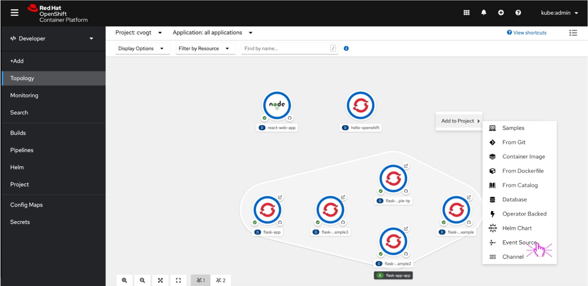

# Developer Catalog enhancements and scaling for event sources

## Type-specific catalogs
### Path 1/2: User selects From Catalog tile

- The user selects From catalog tile on Add page

- When the user arrives on the Developer Catalog view, the categories should remain as they are today.
- The description under the Developer catalog title should read “Add shared applications, services, event sources, or source-to-image builders to your project from the Developer catalog. Cluster administrators can customize the content made available in the catalog.”
- Any selected categories should remain when the user selects Type. For example, if a user selects a language like Java and then selects Helm Charts, the filter of the category should persist.

#### Tooltip interaction and text

- In the interaction above the user clicks the “?” icon to learn more about the types provided.
- The “?” icon has been introduced, which opens a popover.
  - Add the standard “?” icon button with PatternFly colors.
  - #6A6E73 by default. Then #151515 on hover/click.
  - Apply the type names with Medium weight Red Hat font.
  - Apply the type definition with regular Red Hat font.
- Copy in PF popover reads:
  - Builder images are container images that build source code for a  particular language or framework.
  - Event sources are objects that link to an event producer and an event sink or consumer.
  - Helm charts are packages for deploying an application or components of a larger application.
  - Operator backed includes a variety of services managed by Kubernetes controllers.
  - Templates are sets of objects for creating services, build configurations, and anything you have permission to create within a project.

#### User selects sub-category

- If a user selects Java on the Developer catalog. Then the user selects Type, Helm Charts. They will be taken to Helm Charts catalog with Java  selected. If the category or subcategory does not apply or is empty then the Helm Charts catalog will default to All items.
- In the flow below, the user has selected All Items, and, therefore, no subcategories apply when the user arrives on the Helm Charts page.

#### The user selects Helm charts type

- User selects Helm charts type and is taken to the Helm charts catalog

#### Helm charts catalog

- The chart repositories filter is introduced in the Helm charts catalog, and is multi-select.
- The breadcrumb stem takes the user back to the generic developer catalog.
- If the user has selected a category on the Helm charts page, when the user navigates back to the generic developer catalog that category selection should remain until deselected.

### Path 2/2: User selects Helm Charts tile

- When the user selects the Helm chart card from the catalog, the user will be taken directly to the Helm charts catalog.

## Enhancements that apply across all catalog screens
### Category interaction and behavior
- Categories and subcategories that are empty should be hidden. For example, the event sources mockups at the bottom of this document show what it looks like when there are no categories and/or no filters.
- When the user has selected a category or subcategory that subcategory should remain when the user drills down into type. If the user navigates away from Event sources and clicks into Helm charts card on the dev console the same category should be applied, unless the category is unavailable, and then no category selection is made.
- Both the categories and types should have hover states. For example:

- When the user selects a category or subcategory the categories below the selected category should not disappear (as they do today).

### Search experience
- Every search should display “Filter by keyword...” in input field when no data has been input
- PF search interactions:
  - Field input: The user’s input immediately starts filtering down the list as the user types. There is no need for them to press enter.
  - Clear: A clear button is easily accessible once the user begins typing to clear the field if necessary.
- If there are no search results utilize OpenShift design convention [ADD link] for empty states shown below:

### Sorting across the console
- All navigation items and catalog items should default to A-Z sorting.
- Sort by dropdown also lists A-Z, Z-A.

### Interactions and text for type-specific catalogs
- There should be 5 type specific catalogs
  - Builder Images
  - Event Sources
  - Helm Charts
  - Operator Backed
- If another type is added post 4.x a new type specific catalog would also be needed
Example screen from event sources:

These screens appear once the user has selected the type. For example, the user has selected the Event sources type, they are taken to the Event sources catalog. Alternatively,  the user can select the Event sources card on the Add page to drill directly to the type-specific catalog.

### Applies to all type-specific catalog interactions

- Unique descriptions will be written about each new type-specific catalog to provide clarity to the user. For example, the Helm Charts catalog will now have a description specific to Helm Charts which has been mocked-up in the Helm Charts example below:

- All navigation items and catalog items default to A-Z
  - PatternFly breadcrumb appears once the user has selected Type. Breadcrumb behavior is the same across all types. When the user selects the Developer Catalog, the user will be taken back to the developer catalog.

### Builder images catalog
- No new filters will be introduced in 4.7
- Builder image description under header reads “Browse for container images that support a particular language or framework. Cluster administrators can customize the content made available in the catalog.”

### Event sources catalog
- Provider filter will be introduced as part of the  Event sources catalog (if not available, then a fallback screen has been provided below.)
- Event sources description under header reads “Event sources are objects that link to an event producer and an event sink or consumer. Cluster administrators can customize the content made available in the catalog.”

### Helm charts catalog
- Chart repositories filter will be introduced as part of the Helm charts catalog
- Helm charts description under header reads “Browse for charts that help manage complex installations and upgrades. Cluster administrators can customize the content made available in the catalog.”

### Operator backed catalog
- No new filters will be introduced in 4.7
- Operator backed group by dropdown will appear on the Operator backed catalog as it does today, to the right of the A-Z dropdown and only on the Operator backed catalog page.
- Operator backed catalog under header reads “Browse for a variety of managed services that are installed by cluster administrators. Cluster administrators can customize the content made available in the catalog.”

### Templates catalog
- No new filters will be introduced in 4.7
- Templates catalog under header reads “Browse for templates that can deploy services, create builds, or create any resources the template enables. Cluster administrators can customize the content made available in the catalog.”

## Scaling event sources flow

### Path 1/2 - User selects From Catalog tile

- User selects From catalog

- User selects Event sources type

- User arrives on Event sources catalog page

### Path 2/2 - User selects Event Sources tile

- User clicks event sources tile on add page

- Filter by provider

- Sample side panel. User clicks Install.

- If there is no description provided, use the empty state text “No description found for this item” (for more info see OpenShift conventions).

- See Form/YAML story for the user’s next steps in 4.7

### Related design stories
- The user searches for event source and clicks Install.

- See Form/YAML story for the user’s next steps in 4.7

### Adding event sources from topology - right-click menu
- User selects event sources

- See Form/YAML story for the user’s next steps in 4.7
